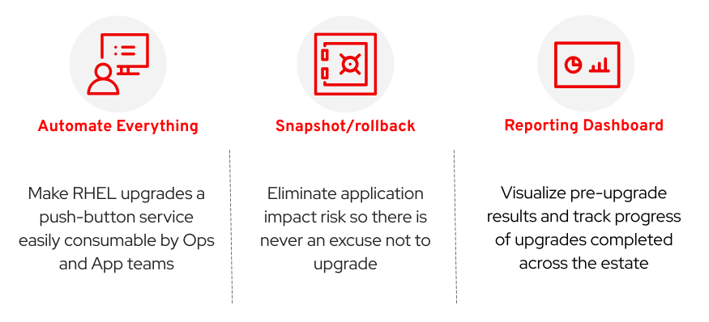
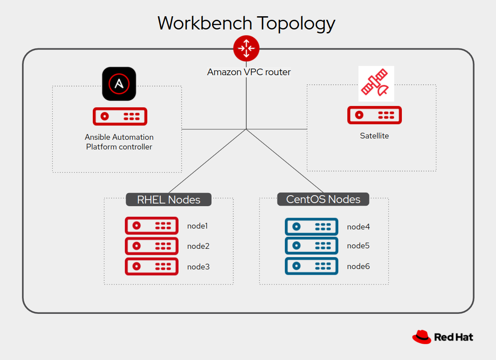

# Automated Satellite Workshop: CentOS to RHEL Conversion

  > **Note**
  >
  > This workshop is available with either CentOS 7 or Oracle Linux 7 nodes. In the case where Oracle Linux nodes are present, substitute "Oracle Linux" wherever "CentOS" is mentioned in the exercise instructions.

This exercise will introduce a comprehensive approach to automate conversions of CentOS 7 to Red Hat Enterprise Linux (RHEL) 7. The solution uses Ansible Automation Platform (AAP) to execute upgrades at enterprise scale across a large estate of CentOS hosts. The exercise demonstrates how to use an example of this approach to perform conversions of CentOS7 to RHEL7. You will also learn about how this solution can be customized to meet the special requirements of your enterprise environment.

There are three key features that the solution approach recommends to deliver success at scale:

As you progress through this exercise, you will learn more about the importance of these features and the different options for how you might implement them in your enterprise. For this exercise, we assume you have at least some experience using Ansible Automation Platform and working with Ansible playbooks and roles. If you're new to Ansible, consider first completing the workshop [Ansible for Red Hat Enterprise Linux](https://aap2.demoredhat.com/exercises/ansible_rhel).

## Table of Contents

- [Automated Satellite Workshop: CentOS to RHEL Conversion](#automated-satellite-workshop:-centos-to-rhel-conversion)
  - [Table of Contents](#table-of-contents)
  - [Presentations](#presentations)
  - [Time Planning](#time-planning)
  - [Lab Diagram](#lab-diagram)
  - [Exercise Sections](#exercise-sections)
    - [Section 1 - Pre-upgrade Analysis](#section-1---pre-upgrade-analysis)
    - [Section 2 - CentOS OS Conversion](#section-2---centos-os-conversion)
    - [Section 3 - Rolling Back](#section-3---rolling-back)
    - [Supplemental Exercises](#supplemental-exercises)
  - [Exercise Navigation](#exercise-navigation)

## Presentations

The exercise sections are self explanatory and guide the participants through all the phases of an automated CentOS to RHEL conversion. All concepts are explained as they are introduced.

There is an optional presentation deck available with additional information on the benefits of the approach demonstrated in this exercise:
[RHEL In-place Upgrades and Conversions Automation](../decks/ansible_ripu_conversion.pdf)

## Time Planning

The time required to complete the exercise depends on the number of participants and how familiar they are with Linux and Ansible. The exercises themselves should take a minimum of ~45 minutes. The introduction in the optional presentation adds 20 to 30 minutes. There are some optional exercises which can be skipped, but are recommended if time allows. Additionally, supplemental exercises at the end of the exercise provide for open-ended experimentation and exploring customizations that may apply to your specific environment and requirements. The lab environment provisioned could even be used for a multi-day deep dive workshop, but that is beyond the scope of this guide.

## Lab Diagram

The lab environment provisioned for the exercise includes an Ansible Automation Platform (AAP) controller, a Red Hat Satellite, and number of RHEL and CentOS instances. The AAP instance is used to run playbook and workflow automation jobs. For this exercise, the jobs are executed against the CentOS hosts which will be converted to RHEL 7. The automation uses LVM to manage the snapshot/rollback capability.

## Exercise Sections

The exercise is composed of three sections each of which includes a number of exercises. Each exercise builds upon the steps performed and concepts learned in the previous exercises, so it is important to do them in the prescribed order.

### Section 1 - Pre-upgrade Analysis

* [1.1 - Workshop Lab Environment](1.1-setup/README.md)
* [1.2 - (Optional) Deploy a Three Tier App](1.2-three-tier-app/README.md)
* [1.3 - Run Pre-conversion Analysis](1.3-preupg/README.md)
* [1.4 - Review Pre-conversion Analysis Reports](1.4-report/README.md)
* [1.5 - Perform Remediations](1.5-remediate/README.md)
* [1.6 - (Optional) Custom Pre-upgrade Checks](1.6-custom-modules/README.md)

### Section 2 - CentOS OS Conversion

* [2.1 - Run OS Conversion Jobs](2.1-upgrade/README.md)
* [2.2 - Let's Talk About Snapshots](2.2-snapshots/README.md)
* [2.3 - Check if the Conversion Worked](2.3-check-convert/README.md)
* [2.4 - (Optional) How is the Three Tier App Doing?](2.4-check-three-tier-app/README.md)

### Section 3 - Rolling Back

* [3.1 - (Optional) Trash an Instance](3.1-error-condition/README.md)
* [3.2 - Run Rollback Job](3.2-rollback/README.md)
* [3.3 - Check if Conversion Undone](3.3-check-undo/README.md)
* [3.4 - Rinse and Repeat](3.4-conclusion/README.md)

## Workshop Navigation

Your will find links to the previous and next exercises at the bottom of each exercise page. Click the link below to get started.

---

**Navigation**

[Next Exercise](1.1-setup/README.md)
